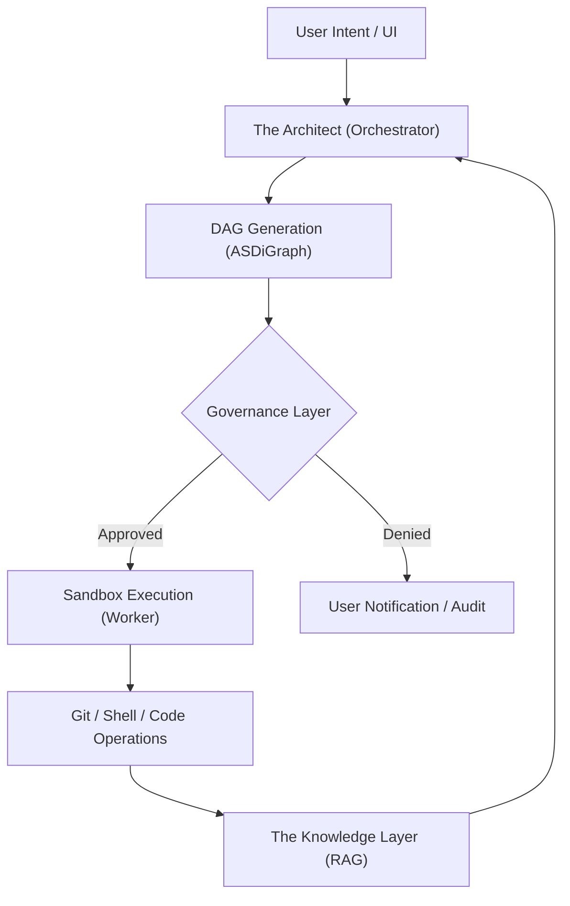

# Technical Specification: ScopeSentinel
## Enterprise Autonomous Software Delivery & Agentic Orchestration Platform

### 1. Vision & Core Objectives
ScopeSentinel is a secure SaaS "Control Plane" designed for building, governing, and monitoring complex multi-agent workflows. Built on the **AgentScope** framework, it provides a unified layer for orchestrating agents that interact directly with enterprise infrastructure while maintaining strict security and compliance boundaries.

---

### 2. System Architecture: The "Safe-Run" Loop
ScopeSentinel employs a **Controller-Worker** architecture. The Control Plane (Controller) manages orchestration, state, and governance, while the Sandbox (Worker) handles high-risk code execution.

#### 2.1 Architectural Diagram

#### 2.2 Core Components
| Component | Responsibility | Tech Stack |
| :--- | :--- | :--- |
| **The Architect** | Orchestrates tasks, parses intent, and manages DAG execution. | AgentScope, Python |
| **The Sandbox** | Provides an isolated environment for agent-led execution. | Docker / gVisor |
| **The Knowledge Layer** | Stores and retrieves context from codebases and documentation. | Qdrant / Milvus |
| **The Control Plane** | Manages multi-tenancy, secrets, and HITL approvals. | FastAPI, PostgreSQL |

---

### 3. Repository Integration Logic
ScopeSentinel handles code through two distinct operational modes, ensuring compatibility with both existing legacy systems and new initiatives.

#### 3.1 Mode A: Brownfield (Legacy Maintenance)
This mode is optimized for existing repositories where agents need to understand complex, pre-existing logic.
1.  **Ingestion:** `RepoService` clones the repository into a transient workspace.
2.  **Indexing:** AgentScope’s `SimpleKnowledge` module scans the repo to build a dependency graph and pattern map.
3.  **Isolation:** Work is performed on a dedicated `sentinel/` branch (e.g., `sentinel/feature-auth-refactor`).

#### 3.2 Mode B: Greenfield (New Development)
Designed for rapid prototyping and new microservices.
1.  **Initialization:** `RepoService` creates a local directory and initializes a GitHub repo via `gh cli`.
2.  **Scaffolding:** The Architect Agent designs the architecture (e.g., DDD, MVC) based on the user's requirements.
3.  **Bootstrap:** Initial commits are performed, including standard CI/CD boilerplate.

---

### 4. Governed Autonomy Layer
To meet enterprise standards, ScopeSentinel implements a multi-layered governance framework.

> [!IMPORTANT]
> **Governed Autonomy** is the core differentiator of ScopeSentinel. Agents are never given unrestricted access; every action is filtered through the governance layer.

#### 4.1 Human-in-the-Loop (HITL)
Using AgentScope’s `handle_interrupt`, the execution pauses at these critical "Gateways":
-   **Plan Approval:** Approval of the proposed DAG before execution.
-   **Commit Approval:** Review of code changes via visual diffs.
-   **Deploy Approval:** Final sign-off before infrastructure or production changes.

#### 4.2 Security Guardrails
-   **Command Sanitization:** Middleware filters high-risk commands (e.g., `rm -rf`, `sudo`).
-   **Secret Masking:** Integration with **HashiCorp Vault**. Agents use ephemeral tokens; sensitive credentials are never injected into LLM prompts.

#### 4.3 Traceability
Every agent interaction is captured as a `Msg` object. This ensures a full audit trail of "who said what" and "who did what" during a task execution.

---

### 5. SaaS Infrastructure & Scalability
-   **Multi-Tenancy:** Hard isolation of knowledge bases and workspaces by Organization ID.
-   **Custom Personas:** Users can define specialized agents (e.g., "QA Specialist", "Security Auditor") with custom toolsets.
-   **MCP Integration:** External tools and context sources (Jira, GitHub, internal APIs) are integrated via the Model Context Protocol (MCP) to ensure standardized, dynamic tool discovery.
-   **API Integration:** All orchestrations are exposed via a **FastAPI** layer for integration into existing Jenkins or GitHub Actions pipelines.

