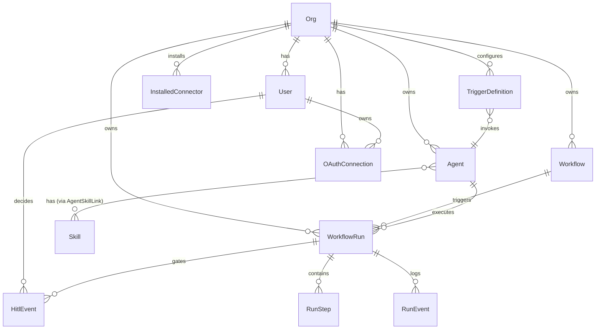

# ScopeSentinel — Platform Architecture

> **Generated:** 2026-04-10  
> **Architecture Style:** Event-driven microservices with durable workflow orchestration  
> **Status:** Active development — Phase 5

---

## 1. Architecture Overview

ScopeSentinel is an **autonomous software delivery platform** that enables engineering teams to orchestrate intelligent AI agents. The platform follows a **microservices architecture** with **event-driven** inter-service communication via Redpanda (Kafka-compatible) and **durable workflow orchestration** via Temporal.

### Key Architectural Characteristics

| Characteristic | Implementation |
|---|---|
| **Architecture Style** | Microservices + Event-Driven + Orchestrated Workflows |
| **Deployment Model** | Docker Compose (self-hosted, mono-host) |
| **API Protocol** | REST (FastAPI) |
| **Async Messaging** | Redpanda (Kafka-compatible event streaming) |
| **Workflow Engine** | Temporal (durable, stateful workflow execution) |
| **Database** | PostgreSQL 16 (shared schema, tenant-isolated via `org_id`) |
| **Cache / Quota** | Redis 7 (sliding-window counters, HITL pub/sub) |
| **Vector Store** | Qdrant (per-tenant knowledge collections for RAG) |
| **Object Storage** | MinIO (S3-compatible artifact storage) |
| **LLM Gateway** | LiteLLM Proxy (model-agnostic routing) |
| **Auth** | NextAuth.js (Google/GitHub/Microsoft SSO) + JWT + API Key |
| **Frontend** | Next.js 14 (App Router) + TailwindCSS + shadcn/ui |

### High-Level System Diagram

```
┌──────────────────────────────────────────────────────────────────────┐
│                         FRONTEND (Next.js)                          │
│   Dashboard │ Agents │ Workflows │ Runs │ Integrations │ Settings   │
└──────────┬───────────────────┬──────────────────────┬───────────────┘
           │ REST              │ REST                  │ REST
           ▼                   ▼                       ▼
┌──────────────────┐  ┌──────────────────┐  ┌──────────────────────┐
│   API Service    │  │ Adapter Service  │  │  Audit / Metering    │
│   (Control Plane)│  │  (Remote MCP)    │  │  Query APIs          │
│   :8000          │  │  :8005           │  │  :8003 / :8004       │
└──┬───────────────┘  └──────────────────┘  └──────────────────────┘
   │                                           ▲          ▲
   │ gRPC                                      │          │
   ▼                                    ┌──────┴──────────┴───────┐
┌──────────────────┐                    │      Redpanda           │
│ Temporal Server  │                    │  (Event Streaming)      │
│   :7233          │                    │  t.{org}.audit          │
└──┬───────────────┘                    │  t.{org}.metering       │
   │                                    │  t.{org}.events         │
   ▼                                    │  incoming-events        │
┌──────────────────┐                    └──────┬──────────────────┘
│ Temporal Worker  │                           │
│ (Agent Runtime)  │                           ▼
│ ReAct + YAML     │                    ┌──────────────────┐
│ Workflows        │                    │ Trigger Engine   │
└──┬───────────────┘                    │ Cron/Event/1-Time│
   │                                    └──────────────────┘
   ▼
┌──────────────┐  ┌──────────┐  ┌──────────┐  ┌──────────┐
│  LiteLLM     │  │ Qdrant   │  │  MinIO   │  │  Redis   │
│  :4000       │  │  :6333   │  │  :9000   │  │  :6379   │
└──────────────┘  └──────────┘  └──────────┘  └──────────┘
```

---

## 2. Component Breakdown

### 2.1 API Service (Control Plane)

| | |
|---|---|
| **Path** | `apps/api/` |
| **Port** | `8000` |
| **Framework** | FastAPI (async, Uvicorn) |
| **Responsibility** | Central REST API for all platform operations |

**Route Modules** (12):

| Router | Endpoint Prefix | Domain |
|---|---|---|
| `runs.py` | `/api/runs` | Workflow run lifecycle, HITL decisions |
| `workflows.py` | `/api/workflows` | Visual workflow CRUD + YAML DSL |
| `agents.py` | `/api/agents` | Agent configuration CRUD |
| `connectors.py` | `/api/connectors` | Connector catalog + install |
| `oauth_connections.py` | `/api/oauth-connections` | OAuth token management |
| `triggers.py` | `/api/triggers` | Trigger definition CRUD |
| `skills.py` | `/api/skills` | Skill (prompt instruction) CRUD |
| `users.py` | `/api/users` | User management + invitations |
| `auth.py` | `/api/auth` | Auth sync + JWT validation |
| `audit.py` | `/api/audit` | Audit log query proxy |
| `health.py` | `/api/health` | Liveness + dependency checks |

**Middleware Stack:**
1. **CORSMiddleware** — Cross-origin request handling
2. **TenantMiddleware** — Extracts `X-ScopeSentinel-Org-ID` → `request.state.org_id`
3. **AuditMiddleware** — Fire-and-forget audit event publishing to Redpanda on mutating calls

**Key Integrations:**
- Dispatches Temporal workflows on `POST /api/runs`
- Publishes audit events to `t.{org_id}.audit` on all POST/PATCH/PUT/DELETE
- Calls Tenant Management Service for org provisioning

---

### 2.2 Agent Runtime (Temporal Worker)

| | |
|---|---|
| **Path** | `apps/agent-runtime/` |
| **Execution Model** | Temporal Worker (no HTTP endpoint) |
| **Task Queue** | `agent-task-queue` |
| **Responsibility** | Executes AI agent workflows durably via Temporal |

**Registered Workflows:**

| Workflow | Purpose |
|---|---|
| `AgentReActWorkflow` | Data-driven ReAct loop: Reason → Act (tool call) → Observe → Repeat |
| `WorkflowYamlWorkflow` | Executes YAML-defined multi-step workflows from the visual designer |

**Registered Activities (3 groups):**

| Group | Activities |
|---|---|
| **ReAct Loop** | `get_agent_config_activity`, `llm_reasoning_activity`, `execute_tool_activity`, `log_event_activity`, `update_run_status_activity`, `get_org_id_activity` |
| **YAML Workflow** | `get_workflow_config_activity` |
| **Legacy/Specialist** | `fetch_ticket_activity`, `planning_activity`, `coder_activity`, `index_repo_activity`, `analyzer_activity` |

**ReAct Loop Flow:**
```
Init → Get Agent Config → Set RUNNING
  ↓
  ┌─── ReAct Loop (max N iterations) ─────────────────────┐
  │  1. LLM Reasoning (with tool definitions)             │
  │  2. Log THOUGHT event                                  │
  │  3. If tool_calls present:                             │
  │     a. Log TOOL_CALL event                             │
  │     b. Execute tool via execute_tool_activity          │
  │     c. Log TOOL_RESULT event                           │
  │  4. Else: break (agent finished)                       │
  └────────────────────────────────────────────────────────┘
  ↓
Finalize → Update status to COMPLETED with token usage
```

---

### 2.3 Adapter Service (Remote MCP)

| | |
|---|---|
| **Path** | `apps/adapter-service/` |
| **Port** | `8005` |
| **Framework** | FastAPI |
| **Responsibility** | Bridge between external tools (Jira, etc.) and the platform via MCP |

**Key Components:**

| Component | Role |
|---|---|
| `ToolRegistry` | Singleton registry mapping `server_name → tool_name → ToolSchema` |
| `ConnectionManager` | Manages lifecycle of MCP client connections |
| `JiraAdapter` | Jira-specific MCP adapter (OAuth, tool discovery, tool invocation) |
| `AdapterFactory` | Creates adapter instances based on provider type |

**Route Modules:** `tools`, `connections`, `oauth`, `connectors`

---

### 2.4 Trigger Engine

| | |
|---|---|
| **Path** | `apps/trigger-engine/` |
| **Execution Model** | Standalone async process (no HTTP endpoint) |
| **Responsibility** | Monitors event sources, fires workflow runs when trigger conditions match |

**Plugin-Based Architecture:**

| Source Plugin | Mechanism | Description |
|---|---|---|
| `CronSource` | APScheduler | Syncs active `schedule` triggers from API, runs cron jobs |
| `OneTimeSource` | Polling (30s interval) | Fetches `one_time` triggers past `run_at`, fires once, deactivates |
| `RedpandaSource` | Kafka consumer | Consumes `incoming-events` topic, matches events against `event_filter` triggers |

**Dispatcher:** On match, calls `POST /api/runs` on the API with retry (3 attempts, exponential backoff).

---

### 2.5 Tenant Management Service

| | |
|---|---|
| **Path** | `apps/tenant-mgmt/` |
| **Port** | `8002` |
| **Framework** | FastAPI |
| **Responsibility** | Org lifecycle: creation, provisioning, configuration, soft deprovisioning |

**Provisioning Pipeline (async background task):**
1. Create Redpanda topics: `t.{org_id}.events`, `t.{org_id}.audit`, `t.{org_id}.metering`
2. Create Qdrant collection: `org_{org_id}_knowledge` (1024-dim cosine vectors)
3. Mark org status → `ACTIVE`

> [!NOTE]
> All tenant data lives in the **shared `public` PostgreSQL schema**, isolated by `org_id` column. No per-tenant PG schemas are created.

---

### 2.6 Audit Service

| | |
|---|---|
| **Path** | `apps/audit/` |
| **Port** | `8003` |
| **Framework** | FastAPI + Redpanda Consumer |
| **Responsibility** | Append-only audit log with query API |

**Dual Mode:**
1. **Consumer:** Subscribes to `t.*.audit` (regex), writes `AuditEvent` rows. Append-only — no UPDATE/DELETE.
2. **Query API:** `GET /audit/events` with filters (`org_id`, `user_id`, `action`, `resource_type`)

---

### 2.7 Metering & Quota Service

| | |
|---|---|
| **Path** | `apps/metering/` |
| **Port** | `8004` |
| **Framework** | FastAPI + Redpanda Consumer |
| **Responsibility** | Usage tracking, billing aggregation, quota enforcement |

**Dual Mode:**
1. **Consumer:** Subscribes to `t.*.metering` (regex), writes `UsageEvent` rows + increments Redis sliding-window counters
2. **API:**
   - `GET /metering/usage` — usage breakdown per org/period
   - `GET /metering/quota/{org_id}/check` — returns 200 (within quota) or 429 (exceeded)

**Quota Enforcement:** Redis keys `quota:{org_id}:{event_type}:{YYYY-MM}` with 32-day TTL.

---

### 2.8 Frontend (Next.js)

| | |
|---|---|
| **Path** | `frontend/` |
| **Port** | `3000` |
| **Framework** | Next.js 14 App Router + TailwindCSS + shadcn/ui |
| **Auth** | NextAuth.js (Google, GitHub, Microsoft Entra ID) |
| **State Mgmt** | React hooks + `useApi()` custom hook for org-aware API calls |

**Page Structure:**

| Route Group | Pages |
|---|---|
| `(auth)` | Sign-in (SSO providers) |
| `(platform)` | Dashboard (main page) |
| `(platform)/agents` | Agent CRUD |
| `(platform)/workflows` | Workflow designer + list |
| `(platform)/runs` | Run history + detail + HITL |
| `(platform)/integrations` | Connector marketplace |
| `(platform)/audit` | Audit log viewer |
| `(platform)/billing` | Usage & metering |
| `(platform)/settings` | Org settings |

**Key Components:** `WorkflowDesigner`, `HitlBanner`, `AppSidebar`, `RunsList`, `AgentForms`

**Auth Flow:**
```
Browser → NextAuth.js → SSO Provider (Google/GitHub/MS)
  ↓ callback
  POST /api/auth/sync (ensure Org + User exist in DB)
  ↓
  JWT enriched with org_id → HS256 backend token
  ↓
  useApi() hook injects X-ScopeSentinel-Org-ID + Bearer token
```

---

## 3. Data Flow Diagram

### 3.1 User-Triggered Agent Run

```
User (UI)
  │
  │ POST /api/runs { agent_id, inputs }
  ▼
API Service ──────────────────────▶ PostgreSQL (create WorkflowRun, status=PENDING)
  │
  │ Start Temporal Workflow (AgentReActWorkflow)
  ▼
Temporal Server
  │
  │ Dispatched to Worker
  ▼
Temporal Worker (Agent Runtime)
  │
  ├── get_agent_config_activity ──▶ API/DB (fetch Agent, Skills, Tools)
  ├── llm_reasoning_activity ─────▶ LiteLLM ──▶ OpenAI/Claude/etc.
  ├── execute_tool_activity ──────▶ Adapter Service ──▶ Jira MCP / etc.
  ├── log_event_activity ─────────▶ PostgreSQL (insert RunEvent)
  └── update_run_status_activity ─▶ PostgreSQL (update WorkflowRun)
```

### 3.2 Event-Driven Trigger Flow

```
External Webhook (Jira, Slack)
  │
  │ POST to webhook endpoint
  ▼
Redpanda topic: "incoming-events"
  │
  ▼
Trigger Engine (RedpandaSource)
  │
  │ Match event_filter against TriggerDefinitions (via API)
  ▼
Dispatcher ──▶ POST /api/runs (with org_id, agent_id, trigger_type)
  │
  ▼
(Same flow as 3.1)
```

### 3.3 Audit & Metering Pipeline

```
API Service (any mutating request)
  │
  ├── AuditMiddleware: fire-and-forget ──▶ Redpanda "t.{org_id}.audit"
  │                                              │
  │                                              ▼
  │                                        Audit Service (consumer)
  │                                              │
  │                                              ▼
  │                                        PostgreSQL: audit_events
  │
  └── (Run lifecycle events) ────────────▶ Redpanda "t.{org_id}.metering"
                                                 │
                                                 ▼
                                           Metering Service (consumer)
                                                 │
                                           ┌─────┴─────┐
                                           ▼           ▼
                                      PostgreSQL    Redis
                                    usage_events   quota counters
```

---

## 4. System Interaction Diagram

### Service-to-Service Communication Matrix

| From → To | Protocol | Pattern | Path/Topic |
|---|---|---|---|
| Frontend → API | HTTP/REST | Sync request/response | `/api/*` |
| Frontend → Adapter | HTTP/REST | Sync request/response | `/api/tools`, `/api/connections/oauth` |
| Frontend → Audit | HTTP/REST | Sync request/response | `/audit/events` |
| Frontend → Metering | HTTP/REST | Sync request/response | `/metering/usage` |
| API → Temporal | gRPC | Async workflow dispatch | `agent-task-queue` |
| API → Redpanda | Kafka produce | Async fire-and-forget | `t.{org}.audit`, `t.{org}.metering` |
| API → Tenant Mgmt | HTTP/REST | Sync (internal) | `/tenants` |
| Temporal Worker → LiteLLM | HTTP/REST | Sync (per activity) | `/chat/completions` |
| Temporal Worker → Adapter | HTTP/REST | Sync (tool execution) | `/api/tools/call` |
| Temporal Worker → PostgreSQL | asyncpg | Sync DB writes | Direct connection |
| Trigger Engine → API | HTTP/REST | Sync dispatch | `POST /api/runs` |
| Trigger Engine → Redpanda | Kafka consume | Async event subscription | `incoming-events` |
| Trigger Engine → API | HTTP/REST | Sync poll | `GET /api/triggers` |
| Audit Service → Redpanda | Kafka consume | Async event subscription | `t.*.audit` (regex) |
| Metering → Redpanda | Kafka consume | Async event subscription | `t.*.metering` (regex) |
| Metering → Redis | Redis protocol | Sync counter increment | `quota:{org}:{type}:{period}` |
| Tenant Mgmt → Redpanda | Kafka admin | Sync topic creation | `t.{org}.*` |
| Tenant Mgmt → Qdrant | HTTP/gRPC | Sync collection creation | `org_{org}_knowledge` |

---

## 5. Infrastructure & Dependencies

### 5.1 Data Stores

| Store | Purpose | Data Durability |
|---|---|---|
| **PostgreSQL 16** | Primary relational DB (all services share one instance) | Volume-mounted |
| **Redis 7** | HITL pub/sub, metering quota counters, caching | Ephemeral (quota state) |
| **Qdrant** | Vector DB for per-tenant RAG knowledge bases | Volume-mounted |
| **MinIO** | S3-compatible object storage (artifacts, code snapshots) | Volume-mounted |
| **Redpanda** | Kafka-compatible event streaming (audit, metering, triggers) | Volume-mounted |

### 5.2 Compute Infrastructure

| Component | Role | Image |
|---|---|---|
| **Temporal Server** | Workflow orchestration (auto-setup with PG backend) | `temporalio/auto-setup` |
| **Temporal UI** | Web UI for workflow debugging | `temporalio/ui` |
| **LiteLLM Proxy** | Model-agnostic LLM router (OpenAI, Claude, etc.) | `ghcr.io/berriai/litellm` |
| **Redpanda Console** | Web UI for Kafka topic inspection | `redpandadata/console` |

### 5.3 Observability Infrastructure

| Tool | Role | Path |
|---|---|---|
| **Fluent Bit** | Log collection + forwarding | `infra/fluent-bit/` |
| **Grafana** | Dashboards + visualization | `infra/grafana/` |
| **OpenTelemetry** | Distributed tracing (configured in `apps/api/otel.py`) | API service |
| **structlog** | Structured logging (JSON/console) across all Python services | All services |

### 5.4 Auth Infrastructure

| Component | Role |
|---|---|
| **NextAuth.js** | SSO federation (Google, GitHub, Microsoft Entra ID) |
| **Keycloak** (profile: `auth`) | Self-hosted IdP (optional, for production SSO) |
| **JWT (HS256)** | Backend token issued by Next.js, validated by API |
| **API Keys** | SHA-256 hashed keys stored in `users.hashed_api_key` |
| **RBAC** | 4-tier role hierarchy: `VIEWER < REVIEWER < DEVELOPER < ADMIN` |

---

## 6. Database Schema & Entity Relationships

### 6.1 Entity-Relationship Diagram



### 6.2 Table Reference

#### Core Domain Tables (API Service — `apps/api/db/models.py`)

| Table | Key Columns | Purpose |
|---|---|---|
| `orgs` | `id`, `name`, `slug`, `status`, `tenant_config` | Organisation (tenant) record |
| `users` | `id`, `org_id`, `email`, `role`, `hashed_api_key` | Platform users with RBAC |
| `agents` | `id`, `org_id`, `name`, `identity`, `model`, `tools_json`, `max_iterations`, `memory_mode` | AI agent configuration |
| `skills` | `id`, `org_id`, `name`, `content`, `version` | Reusable prompt instructions attached to agents |
| `agent_skill_links` | `agent_id`, `skill_id` | M:N join table |
| `workflows` | `id`, `org_id`, `name`, `yaml_content`, `version`, `status` | Visual workflow definitions (YAML DSL) |
| `workflow_runs` | `id`, `org_id`, `workflow_id`, `agent_id`, `status`, `trigger_type`, `temporal_workflow_id`, `plan_json`, `token usage` | Individual execution records |
| `run_steps` | `id`, `run_id`, `step_name`, `status`, `input_json`, `output_json`, `token usage` | Per-step granularity within a run |
| `run_events` | `id`, `run_id`, `event_type`, `payload_json` | Agent reasoning trace (THOUGHT, TOOL_CALL, TOOL_RESULT, ERROR, LOG, FINISH) |
| `hitl_events` | `id`, `run_id`, `action`, `feedback`, `decided_by_id` | Human-in-the-loop decision log |
| `installed_connectors` | `id`, `org_id`, `connector_id`, `config_json` | Per-org connector installations |
| `oauth_connections` | `id`, `org_id`, `user_id`, `provider`, `access_token_encrypted`, `refresh_token_encrypted`, `scopes`, `provider_metadata` | OAuth token storage (encrypted) |
| `trigger_definitions` | `id`, `org_id`, `agent_id`, `trigger_type`, `cron_expr`, `run_at`, `event_filter_json`, `inputs_json` | Automated trigger rules |

#### Tenant Management Tables (`apps/tenant-mgmt/models.py`)

| Table | Key Columns | Purpose |
|---|---|---|
| `orgs` | (shared with API) | Organisation record |
| `tenant_provision_logs` | `id`, `org_id`, `step`, `status`, `detail` | Provisioning step audit trail |

#### Audit Service Tables (`apps/audit/models.py`)

| Table | Key Columns | Purpose |
|---|---|---|
| `audit_events` | `id`, `org_id`, `user_id`, `action`, `resource_type`, `resource_id`, `payload_json`, `occurred_at` | Immutable audit log |

#### Metering Service Tables (`apps/metering/models.py`)

| Table | Key Columns | Purpose |
|---|---|---|
| `usage_events` | `id`, `org_id`, `event_type`, `tokens`, `occurred_at` | Raw billable events |
| `usage_buckets` | `id`, `org_id`, `period_start`, `runs_count`, `steps_count`, `tokens_used`, `llm_calls_count` | Hourly pre-aggregated usage |

---

## 7. Event Streaming Topology

### 7.1 Redpanda Topics

| Topic | Producer | Consumer | Event Contract |
|---|---|---|---|
| `t.{org_id}.audit` | API AuditMiddleware | Audit Service | `{ org_id, user_id, action, resource_type, resource_id, payload: { method, path, status_code } }` |
| `t.{org_id}.metering` | API (run lifecycle) | Metering Service | `{ org_id, event_type: "run" \| "step" \| "llm_call", tokens: int }` |
| `t.{org_id}.events` | (General inbound events) | (Future consumers) | Application-specific |
| `incoming-events` | External webhooks | Trigger Engine (RedpandaSource) | `{ source, event_type, org_id, payload: {...} }` |

### 7.2 Event Contracts

**Audit Event:**
```json
{
  "org_id": "uuid",
  "user_id": "uuid | null",
  "action": "post:/api/runs",
  "resource_type": "runs",
  "resource_id": null,
  "payload": {
    "method": "POST",
    "path": "/api/runs",
    "status_code": 201
  }
}
```

**Metering Event:**
```json
{
  "org_id": "uuid",
  "event_type": "run | step | llm_call",
  "tokens": 1500
}
```

**Incoming Event (Jira Webhook):**
```json
{
  "source": "jira",
  "event_type": "jira:issue_created",
  "org_id": "uuid",
  "payload": {
    "issue": { "key": "SCRUM-42", "fields": { "summary": "..." } }
  }
}
```

---

## 8. UI → API → Backend Flow

### 8.1 Frontend State Management

| Pattern | Technology | Usage |
|---|---|---|
| **Server State** | `useApi()` custom hook (wraps `fetch()`) | All API calls inject `org_id` + JWT |
| **Client Rendering** | React hooks (`useState`, `useEffect`) | Component-level UI state |
| **Routing** | Next.js App Router (route groups) | `(auth)` vs `(platform)` layouts |
| **Auth** | NextAuth.js `useSession()` | Session management + org context |

### 8.2 API Client Architecture

```
useApi() hook
  ├── Reads session (org_id, accessToken) from NextAuth
  ├── Injects headers: X-ScopeSentinel-Org-ID, Authorization
  └── Delegates to api-client.ts
        ├── getBaseUrlForPath(path)
        │     /api/*         → API_BASE (:8000)
        │     /audit/*       → AUDIT_API_BASE (:8003)
        │     /metering/*    → METERING_API_BASE (:8004)
        │     /api/tools/*   → ADAPTER_SERVICE_BASE (:8005)
        └── apiFetch() / apiGet() / apiPost() / apiPatch() / apiDelete()
```

### 8.3 Full Stack Request Flow

```
Browser (React Component)
  │ useApi().post("/api/runs", { agent_id, inputs })
  ▼
Next.js (Client) ──▶ API Service (:8000)
  │                    │
  │                    ├── TenantMiddleware: extract org_id
  │                    ├── RBAC: validate JWT → require DEVELOPER+
  │                    ├── Create WorkflowRun (PostgreSQL)
  │                    ├── Start Temporal Workflow
  │                    └── AuditMiddleware: publish to Redpanda
  │
  ▼
Temporal Worker (ReAct Loop)
  ├── LLM reasoning (via LiteLLM)
  ├── Tool execution (via Adapter Service → Jira MCP)
  ├── Event logging (PostgreSQL)
  └── Status updates (PostgreSQL)
  │
  ▼
Browser (polling /api/runs/{id})
  └── Render run events, steps, HITL gates
```

---

## 9. Observations & Risks

### 9.1 Confirmed Strengths

| Area | Observation |
|---|---|
| **Event-Driven Architecture** | Clean separation: API produces events, downstream services consume them asynchronously |
| **Durable Workflows** | Temporal provides automatic retries, state persistence, and visibility into running workflows |
| **Plugin Architecture** | Trigger Engine uses `TriggerSource` ABC — extensible without modifying core logic |
| **Tenant Isolation** | Consistent `org_id`-based filtering across all services + per-tenant Redpanda topics |
| **Auth Layering** | Multi-strategy auth (SSO + API keys) with 4-tier RBAC hierarchy |
| **Observability** | structlog + OpenTelemetry + Grafana + audit trail provides full traceability |

### 9.2 Technical Debt & Anti-Patterns

| Issue | Severity | Location | Description |
|---|---|---|---|
| **AuditMiddleware creates producer per request** | 🔴 High | `apps/api/middleware.py:94-102` | A new `AIOKafkaProducer` is created and destroyed for every audit event. Should use a shared, long-lived producer. |
| **No JWT signature verification** | 🔴 High | `apps/api/auth/rbac.py:93-113` | JWT payload is decoded without signature verification (base64 decode only). Comment says "Kong validates", but no Kong is deployed. |
| **Makefile uses stale paths** | 🟡 Medium | `Makefile:15-17` | References `services/agent-runtime` and `services/api` but code lives in `apps/`. |
| **Hardcoded internal auth token** | 🔴 High | `docker-compose.yml:255` | Static JWT token for Trigger Engine → API communication is hardcoded in compose file. |
| **Multiple shared-DB patterns** | 🟡 Medium | All services | All services (audit, metering, tenant-mgmt, API) connect to the same PostgreSQL instance independently rather than through a shared schema registry. Risk of table name collisions. |
| **`asyncio.create_task` fire-and-forget** | 🟡 Medium | `apps/api/middleware.py:79` | Audit publishing uses `asyncio.create_task` without error handling or tracking. Exceptions in the task are silently lost. |
| **Legacy CLI entrypoint** | 🟢 Low | `apps/agent-runtime/main.py` | CLI mode (`main.py`) still exists alongside the Temporal worker. Retained for backward compat but duplicates workflow logic. |
| **No database migrations for sidecar services** | 🟡 Medium | `apps/audit/`, `apps/metering/` | Use `SQLModel.metadata.create_all` directly — no Alembic migrations for schema evolution |
| **No circuit breaker** | 🟡 Medium | `apps/trigger-engine/dispatcher.py` | Dispatcher retries with backoff but has no circuit breaker for persistent API failures |

### 9.3 Scalability Considerations

| Area | Current State | Recommendation |
|---|---|---|
| **Horizontal Scaling** | Single-instance per service (Docker Compose) | Add Kubernetes manifests for horizontal pod autoscaling |
| **Database** | Single PostgreSQL instance for all services | Consider read replicas; separate databases for audit/metering (high write volume) |
| **Event Processing** | Single consumer per consumer group | Partition-based scaling ready (3 partitions per topic) |
| **Temporal Workers** | Single worker instance | Scale by deploying multiple worker replicas (Temporal handles task distribution) |
| **LLM Calls** | Sequential tool execution in ReAct loop | Parallel tool execution when tools are independent |

---

## 10. Recommendations & Improvements

### 10.1 Critical (Address Immediately)

1. **Fix JWT verification**: Implement proper HS256 signature validation using `AUTH_SECRET`. The current base64-decode-only approach is a security vulnerability.

2. **Use a shared Kafka producer**: Replace per-request producer instantiation in `AuditMiddleware` with a singleton `AIOKafkaProducer` initialized at application startup.

3. **Rotate hardcoded tokens**: Replace the static `INTERNAL_AUTH_TOKEN` in docker-compose with a proper secret management solution (e.g., Docker secrets, Vault).

### 10.2 High Priority (Next Sprint)

4. **Add Alembic migrations to sidecar services**: `audit` and `metering` services use `create_all` which cannot handle schema evolution. Add Alembic for production readiness.

5. **Fix Makefile paths**: Update `AGENT_DIR`, `API_DIR`, and `ADAPTER_DIR` to point to `apps/` instead of `services/`.

6. **Add circuit breaker to Trigger Engine dispatcher**: Use `tenacity` or `pybreaker` to prevent cascading failures when the API is down.

### 10.3 Medium Priority (Backlog)

7. **Consolidate database access**: Consider a shared library/package for database models to prevent model drift between services.

8. **Add API gateway**: Deploy Kong or Traefik in front of all services for unified rate limiting, JWT validation, and routing.

9. **Implement parallel tool execution**: In `AgentReActWorkflow`, execute independent tool calls concurrently using `asyncio.gather`.

10. **Add health-check aggregation**: Create a unified health dashboard that checks all services rather than individual `/health` endpoints.

---

*Document generated from codebase analysis of the ScopeSentinel repository at `2026-04-10`.*
