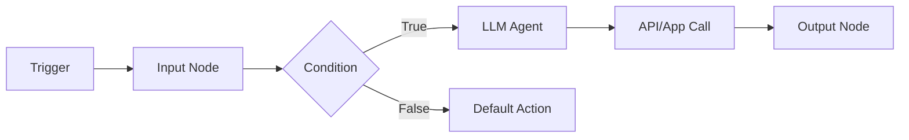
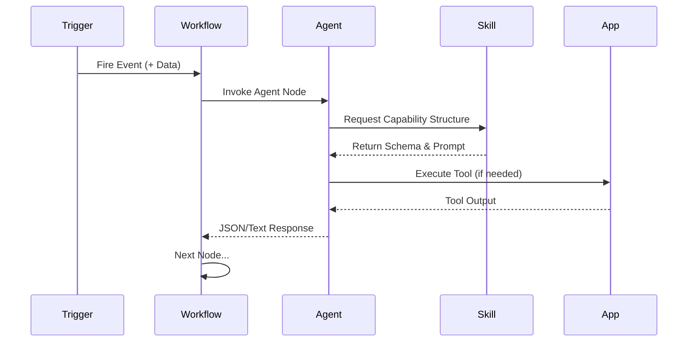

# 🛡️ ScopeSentinel: Product Requirements Document (PRD)

ScopeSentinel is a comprehensive platform designed to empower users with AI-powered agents, dynamic workflows, and seamless application integrations. This document outlines the functional requirements for the core system components.

---

## 📋 Table of Contents

- [1. 🧑‍💻 Agents](#1--agents)
- [2. 🔄 Workflows](#2--workflows)
- [3. ⏱️ Triggers](#3--triggers)
- [4. 🧠 Skills](#4--skills)
- [5. 🔌 Apps (Integrations)](#5--apps-integrations)
- [6. 🔗 Cross-Component Interactions](#6-cross-component-interactions)
- [7. 📊 Execution & Observability](#7--execution--observability)
- [8. 🔐 Access Control](#8--access-control)

---

## 1. 🧑‍💻 AI Agents

### 1.1 Objective
Enable users to create AI-powered agents that can execute tasks using instructions, skills, workflows, and connected apps.

### 1.2 Functional Requirements

| ID | Requirement | Description |
| :--- | :--- | :--- |
| **FR-A1** | **Create Agent** | Users can define Name, Description, Instructions (system prompt), and Model selection (LLM). |
| **FR-A2** | **Configure Preferences** | Selection of specific LLMs (e.g., GPT-4o, Claude 3.5 Sonnet). Enable/disable self-updates and tool access. |
| **FR-A3** | **Attach Skills** | Add or remove reusable capabilities to a specific agent. |
| **FR-A4** | **Attach Apps** | Grant agent access to specific connected third-party applications. |
| **FR-A5** | **Manual Execution** | Synchronous interaction via a text query interface. |
| **FR-A6** | **Programmatic Invocation**| Execution triggered by workflows or external events with structured payloads. |
| **FR-A7** | **Output Handling** | Support for both natural language and structured JSON outputs based on schema. |

> [!NOTE]
> System must persist all agent configurations and maintain strict isolation between available skills/apps.

---

## 2. 🔄 Workflows

### 2.1 Objective
Allow users to define multi-step automation pipelines using a flexible, visual-builder approach.

### 2.2 Functional Requirements

#### Visual Builder & Graph
- **FR-W1: Create Workflow**: Define name and description; initializes an empty canvas.
- **FR-W2: Node Types**: Support for LLM, API, Condition (Logic), and Input/Output nodes.
- **FR-W4: Node Connections**: Define directed edges to maintain execution order and branching logic.

#### Node Configuration
- **FR-W3: Node Setup**: 
    - **LLM Node**: Select Agent, Skill, and map inputs.
    - **API Node**: Select App, Action (e.g., "Create Jira Issue"), and configure payload.
    - **Condition Node**: Define boolean logic (Equals, Contains, GT/LT).

#### Execution & State
- **FR-W5: Data Mapping**: JSON path-based mapping from Node A output to Node B input.
- **FR-W6: Execution Engine**: Sequential traversal starting from the entry node.
- **FR-W7: State Management**: Persistent execution context to track intermediate data across async steps.
- **FR-W8: Error Handling**: Per-node retry policies and dedicated failure handling paths.

---

## 3. ⏱️ Triggers

### 3.1 Objective
Automatically initiate workflows or agents based on temporal schedules or external events.

### 3.2 Functional Requirements

- **FR-T1: Unified Registry**: Support for both Time-based and Event-based triggers.
- **FR-T2: Time-Based**: Support standard Cron expressions for periodic execution.
- **FR-T3: Event-Based**: Support for Webhooks and native App-based events (e.g., "New File in Drive").
- **FR-T4/T5: Invocation**: Automatically generate payloads and execute the target target (workflow/agent) with data mapping.

---

## 4. 🧠 Skills

### 4.1 Objective
Provide modular, reusable, and structured capabilities that can be "taught" to agents.

### 4.2 Functional Requirements

- **FR-S1: Skill Definition**: Name, description, and highly specific prompt templates.
- **FR-S2: Schema Enforcement**: Define expected output structure using JSON Schema.
- **FR-S3: Injection**: Dynamically inject skill prompts into the agent's LLM context.
- **FR-S5: Validation**: Automated validation of LLM output against the skill's defined schema.

> [!TIP]
> Skills are the building blocks of agent intelligence. Well-defined schemas ensure predictable data flow in complex workflows.

---

## 5. 🔌 Apps (Integrations)

### 5.1 Objective
Securely connect ScopeSentinel to the external tools and services users already use.

### 5.2 Functional Requirements

- **FR-AP1: Authentication**: Support for OAuth2 flows and API Key management.
- **FR-AP2: Connection Management**: Centralized dashboard to view, refresh, or revoke app permissions.
- **FR-AP3/AP4: Action Execution**: Standardized interface to interact with third-party APIs and receive structured responses.
- **FR-AP5: Trigger Source**: Apps act as event emitters for workflow automation.

---

## 🔗 6. Cross-Component Interactions

The power of ScopeSentinel comes from the interplay between its core modules:

---

## 📊 7. Execution & Observability

### 7.1 Objective
Provide full transparency into every automated action taken by the platform.

### 7.2 Functional Requirements
- **FR-O1: Live Logging**: Real-time logging of trigger fires and node-by-node execution.
- **FR-O2: Run History**: Persistent archive of every execution with searchable input/output payloads.
- **FR-O3: Debugging**: "Time-travel" debugging allowing users to replay runs or inspect full execution traces.

---

## 🔐 8. Access Control & Security

### 8.1 Functional Requirements

> [!IMPORTANT]
> User data isolation and credential security are non-negotiable architectural requirements.

- **FR-SEC1: Multi-Tenancy**: Strict isolation ensuring users only see their own agents, workflows, and connections.
- **FR-SEC2: Credential Encryption**: All auth tokens and API keys must be encrypted at rest using industry-standard protocols.